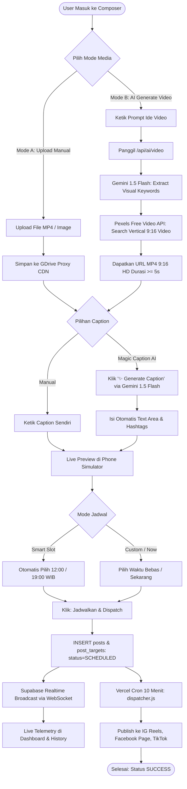

# Rancangan Autopilot AI: Hybrid Video & Smart Caption Engine
> **Status:** Final Architectural Specification (Aligned via `/grill-me` + `/ponytail`)  
> **Filosofi Desain:** Ponytail (Lean, Zero Unnecessary Abstraction, 100% Free Dev Stack, Direct-to-Queue)

---

## 1. Ringkasan Eksekutif (Executive Summary)
Memperluas modul Composer menjadi **Hybrid Studio**:
1. **Opsi Input Media:**
   - **Upload Manual:** Pengguna mengunggah video/gambar sendiri (Google Drive / Direct File).
   - **AI Contextual Video Engine (100% Gratis untuk Dev):** Pengguna mengetik ide prompt teks ➔ **Gemini 1.5 Flash** menerjemahkan visual keywords ➔ **Pexels Free Video API** mengambil video vertikal asli kualitas HD 9:16 (5–15 detik) yang dijamin 100% lolos validasi TikTok dan Instagram Reels.
2. **Opsi Caption & Copywriting:**
   - **Manual Input:** Mengetik caption dan memilih hashtag sendiri.
   - **Magic Caption AI (Gemini 1.5 Flash - Gratis):** 1-klik untuk menghasilkan caption persuasif, hook pembuka, dan hashtag trending berdasarkan topik atau konteks video.
3. **Eksekusi & Penjadwalan:**
   - Pratinjau instan di Phone Simulator.
   - Penjadwalan cerdas (Slot Jam Ramai: 12.00 & 19.00 WIB) atau Posting Langsung.
   - Auto-dispatch ke Instagram Reels, Facebook Page, dan TikTok via engine antrean yang sudah ada.

---

## 2. Diagram Alir Sistem (Hybrid End-to-End Flowchart)



---

## 3. Matriks Arsitektur Rekomendasi Ponytail (100% Free Dev Stack)

| Komponen | Opsi Terpilih | Alasan & Keunggulan (Ponytail Principle) |
| :--- | :--- | :--- |
| **Engine Copywriting** | **Google Gemini 1.5 Flash (Gratis)** | Gratis 15 Request Per Menit via Google AI Studio. Sangat cepat (< 800ms), kualitas bahasa Indonesia natural. |
| **Engine Video Dev** | **Gemini + Pexels API (Gratis)** | Menghasilkan video vertikal HD 9:16 asli (bukan AI glitch), bebas royalti, 0 biaya, dan 100% lolos validasi `duration_check` TikTok. |
| **Upgrade Path (Production)** | **Replicate / Veo Adapter** | Kode backend disiapkan modular. Cukup masukkan `REPLICATE_API_TOKEN` nanti jika ingin beralih ke generative video AI berbayar tanpa ubah UI. |
| **Penyimpanan Media** | **Direct Public CDN & GDrive** | 0 biaya storage server, server Meta & TikTok langsung fetch dari CDN Pexels/Google Drive. |
| **Real-Time Sync** | **Supabase Realtime (WebSocket)** | 0 server cost di Vercel, updates live seketika di frontend. |

---

## 4. Panduan Mendapatkan API Key Gratis (Langkah Demi Langkah)

### A. Mendapatkan Google Gemini API Key (100% GRATIS)
1. Buka browser dan kunjungi: **[Google AI Studio](https://aistudio.google.com/)**
2. Login menggunakan akun Google Anda.
3. Klik tombol biru **"Get API key"** di pojok kiri atas.
4. Klik **"Create API key"** ➔ pilih opsi *"Create API key in new project"* (atau pilih project Google Cloud yang sudah ada).
5. Salin API Key yang muncul.
6. Masukkan ke file `.env` di proyek Anda:
   ```env
   GEMINI_API_KEY="AIzaSy..."
   ```
*(Kuota gratis: 15 Requests Per Minute / 1.500 Requests Per Day — Sangat lebih dari cukup untuk dev & personal use).*

---

### B. Mendapatkan Pexels Video API Key (100% GRATIS)
1. Buka website: **[Pexels API Portal](https://www.pexels.com/api/)**
2. Buat akun gratis atau login dengan Google.
3. Klik tombol **"Get Started"** atau **"Request API Key"**.
4. Isi formulir singkat tujuan penggunaan (misal: *"Personal Social Media Auto-Poster Application"*).
5. Kunci API Key Anda akan langsung dibuat seketika tanpa perlu verifikasi kartu kredit.
6. Masukkan ke file `.env` di proyek Anda:
   ```env
   PEXELS_API_KEY="s5D8..."
   ```
*(Kuota gratis: 200 request/jam dan 20.000 request/bulan — 100% gratis selamanya).*

---

## 5. Rincian Modul & Implementasi

### A. Endpoint Backend Serverless
1. **`api/ai/caption.js`**:
   - Input: `{ topic: string, tone?: string, platform?: string }`
   - Memanggil model **Gemini 1.5 Flash**.
   - Output: `{ caption: string, hashtags: string[], hook: string }`
2. **`api/ai/video.js`**:
   - Input: `{ prompt: string, orientation?: 'portrait' }`
   - Memanggil Gemini untuk mengekstrak keyword visual terbaik (contoh: *"Cyberpunk Street Night"*).
   - Memanggil Pexels Video API mencari video vertikal HD (`orientation=portrait`, durasi 5–15 detik).
   - Output: `{ videoUrl: string, duration: number, previewUrl: string, title: string }`

### B. Komponen Frontend (`src/features/composer/`)
1. **Magic Caption Button di `CaptionEditor.tsx`**:
   - Tombol satu-klik `✨ Magic AI Caption` dengan input topik cepat atau auto-detect dari judul.
2. **Tab Mode di `MediaUploader.tsx`**:
   - Tab 1: `Upload Manual` (Google Drive / File Lokal).
   - Tab 2: `Generate Video AI` (Prompt box + indikator proses render).
3. **Quick Slot Button di `SchedulePicker.tsx`**:
   - Tombol cepat: `⚡ Slot Jam Ramai Terdekat (12:00 / 19:00 WIB)`.

---

## 6. Rencana Pelaksanaan (Action Plan)
- [ ] **Step 1:** Buat endpoint `/api/ai/caption.js` terhubung dengan Google Gemini API.
- [ ] **Step 2:** Buat endpoint `/api/ai/video.js` dengan adapter Pexels + Gemini Keyword Extractor (plus fallback mock).
- [ ] **Step 3:** Pasang tombol Magic Caption di [CaptionEditor.tsx](file:///home/yoga/Dokumen/auto-poster/src/features/composer/components/CaptionEditor.tsx).
- [ ] **Step 4:** Pasang mode switch AI Video di [MediaUploader.tsx](file:///home/yoga/Dokumen/auto-poster/src/features/composer/components/MediaUploader.tsx).
- [ ] **Step 5:** Uji coba end-to-end langsung di Phone Simulator & History.
