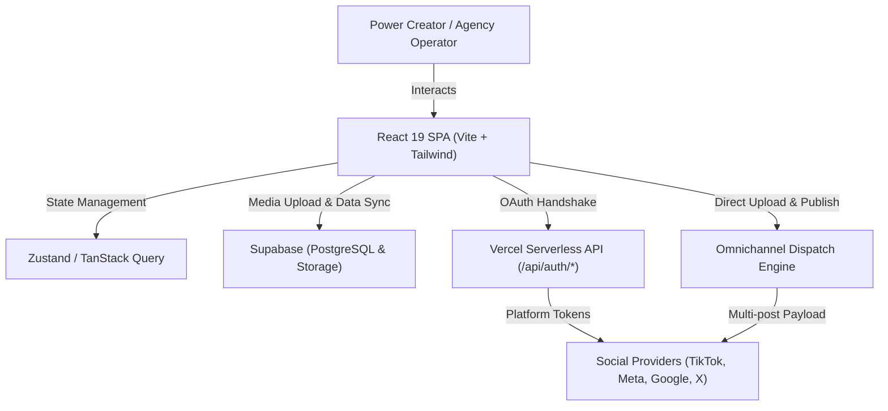

# Software Design Document (SDD): Omnichannel Auto-Poster Engine

**Document Version:** 1.0.0  
**Target Architecture & Redesign:** Minimalist High-Density SaaS UI (Linear/Raycast aesthetic)  
**Date:** October 2026  
**Status:** Ready for Redesign via Google Stitch  

---

## 1. System Overview & Executive Summary

**Omnichannel Auto-Poster** adalah engine otomatisasi distribusi konten media sosial (TikTok, Instagram, YouTube, X/Twitter, Threads, Facebook, LinkedIn, Pinterest) dengan pipeline terintegrasi:
- **Client App:** React 19 (SPA) + Vite + Tailwind CSS + Lucide Icons + TanStack Query + Zustand.
- **Backend Edge / Serverless:** Vercel Serverless Functions (`api/auth/*`, OAuth callback handshakes, token refreshment).
- **Storage & Database:** Supabase (PostgreSQL, Storage buckets, Row Level Security).
- **Core Goal Redesign:** Mentransformasi UI aplikasi menjadi **High-Density, Minimalist Linear/Raycast-grade SaaS** yang dioptimalkan untuk agensi dan power creator multi-akun, meminimalkan cognitive overload serta memaksimalkan efisiensi komposisi dan pemantauan distribusi konten.

---

## 2. Architecture & Tech Stack

### Key Technical Specs
| Layer | Technology | Purpose |
| :--- | :--- | :--- |
| **Frontend Framework** | React 19, TypeScript | Reactive, type-safe client UI |
| **Bundler & Dev Server**| Vite 6 | Sub-second HMR & modular packaging |
| **Design System** | Tailwind CSS + Radix UI Primitives | High-density customizable UI |
| **State & Data Store** | Zustand, Supabase JS Client | Offline-first tokens & dynamic caching |
| **Backend & OAuth** | Node Serverless (`/api/auth/*`) | Secure secret exchange & HMAC verification |

---

## 3. UI/UX Hierarchy & Screen Mapping

Berdasarkan arsitektur aktif di [src/App.tsx](file:///home/yoga/Dokumen/auto-poster/src/App.tsx), berikut pemetaan 6 layar utama yang telah di-capture untuk referensi Google Stitch:

| No | Screen | Route | Screenshot Reference | Core Purpose & Key Elements |
|:---|:---|:---|:---|:---|
| 1 | **Dashboard Overview** | `/` | [01_dashboard.png](file:///home/yoga/Dokumen/auto-poster/doc/screenshots/01_dashboard.png) | Metrics agregat (posts published, pending, platform distribution, recent activity timeline). |
| 2 | **Omnichannel Composer**| `/composer` | [02_composer.png](file:///home/yoga/Dokumen/auto-poster/doc/screenshots/02_composer.png) | High-speed multi-platform editor, video uploader, platform toggles, cross-preview simulator. |
| 3 | **Publication History** | `/history` | [03_history.png](file:///home/yoga/Dokumen/auto-poster/doc/screenshots/03_history.png) | High-density log table, filtering status (Published, Failed, Scheduled), retry engine. |
| 4 | **Account Connections** | `/settings` | [04_settings.png](file:///home/yoga/Dokumen/auto-poster/doc/screenshots/04_settings.png) | OAuth connection grid (TikTok, YouTube, Meta, X), token health check, quota usage. |
| 5 | **Terms of Service** | `/terms` | [05_terms.png](file:///home/yoga/Dokumen/auto-poster/doc/screenshots/05_terms.png) | Legal compliance, developer platform compliance disclaimer. |
| 6 | **Privacy Policy** | `/privacy` | [06_privacy.png](file:///home/yoga/Dokumen/auto-poster/doc/screenshots/06_privacy.png) | User data privacy statement, token retention, GDPR/CCPA alignment. |

---

## 4. Current State Screenshots

Semua tangkapan layar telah disimpan secara lokal di repositori pada folder `doc/screenshots/`:

1. **Dashboard Overview (`/`)**  
   

2. **Omnichannel Composer (`/composer`)**  
   

3. **Publication History (`/history`)**  
   

4. **Account Connections & Settings (`/settings`)**  
   

5. **Terms of Service (`/terms`)**  
   

6. **Privacy Policy (`/privacy`)**  
   

---

## 5. Google Stitch Redesign Blueprint (Linear / Raycast Style)

### 5.1 Design Tokens & Guidelines
- **Color Palette (Dark High-Density Base):**
  - Background Canvas: `#0D0E11` (Deep dark slate)
  - Surface / Card: `#14161C` with subtle `1px solid rgba(255,255,255,0.08)` border.
  - Accent / Primary: `#5E6AD2` (Linear-like Blurple) with `#4F52B2` hover.
  - Text Primary: `#EDEDED`, Text Muted: `#8A8F98`, Text Subtle: `#565A63`.
  - Status Pills: Emerald (`#10B981`), Amber (`#F59E0B`), Rose (`#F43F5E`) with low-opacity alpha backgrounds (`bg-opacity-10`).
- **Typography:**
  - Font Stack: `Inter`, `Geist Sans`, or `-apple-system, BlinkMacSystemFont`.
  - Tight tracking (`tracking-tight`), compact headers (`text-xs font-semibold uppercase text-muted`).
- **Spacing & Density:**
  - Compact paddings (`p-3`, `px-4 py-2`), 4px/8px micro-grid.
  - Keyboard shortcuts indicators (`⌘K`, `⌘Enter` to publish).

### 5.2 Stitch Prompting Strategies for Key Views
1. **Composer Screen:**
   > *"Redesign a multi-platform social media composer in a dark, high-density Linear SaaS style. Left pane: keyboard-driven caption editor with platform tag selectors (TikTok, Instagram, YouTube) and drag-and-drop media dropzone. Right pane: dynamic real-time phone simulator preview with toggleable platform tabs. Visuals: crisp borders, muted monochrome tones with subtle indigo accents."*
2. **Dashboard Overview:**
   > *"Redesign a creator operations dashboard with ultra-clean micro-metrics cards (Total Posts, Queued, Success Rate, Active Channels) with sparkline trends, followed by a compact activity feed table with inline status pills and quick-action tooltips."*
3. **Accounts Grid:**
   > *"Redesign social account connection cards into high-density tiles displaying platform badge, account handle, connection status ping (green/red dot), token expiration countdown, and 'Reconnect' / 'Disconnect' micro-buttons."*

---

## 6. Implementation & Transition Plan

1. **Stitch Canvas Iteration:** Gunakan prompt dan screenshot acuan di atas ke Google Stitch / MCP Stitch untuk menghasilkan varian tampilan.
2. **Component Token Alignment:** Sesuaikan file [src/index.css](file:///home/yoga/Dokumen/auto-poster/src/index.css) dan konfigurasi Tailwind dengan palet Linear dark mode.
3. **Refactor Primitives:**
   - Pertahankan logic handler di feature hooks (`useComposer`, `useAccounts`).
   - Terapkan layout baru ke `MainLayout` dan sidebar navigation.
