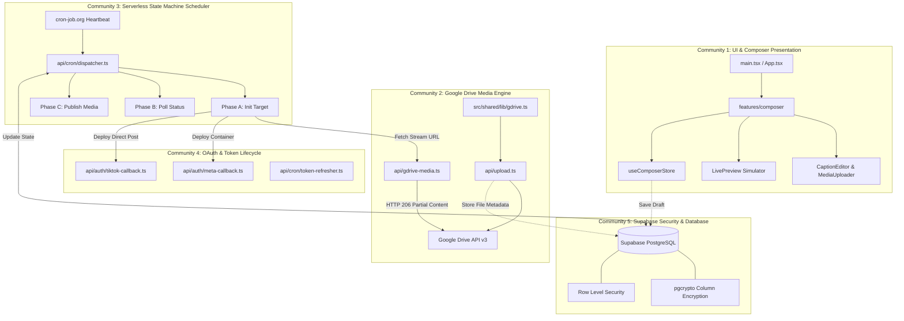

# Technical Specification Document (TSD)
## Omnichannel Social Media Auto-Poster Engine (OSM-APE)
### High-Performance Lightweight Architecture: React Vite TS, Shadcn UI, Supabase (DB & Auth), Google Drive Media Engine, & Vercel Serverless

---

**Document Version:** 2.0.0  
**Target Project:** Omnichannel Social Media Auto-Poster Engine (OSM-APE)  
**Standard Reference:** Architecture & Codebase Conventions from `/home/yoga/Dokumen/nfc-google-review`  
**Methodology:** Ponytail (Lean, YAGNI, Zero Speculative Abstraction) & Graphify Knowledge Architecture  
**Author:** Senior Tech Lead / Antigravity AI  
**Status:** Approved for Implementation  

---

## 1. Executive Summary & Ponytail Architectural Analysis

Dokumen Spesifikasi Teknis (TSD) ini mendefinisikan arsitektur sistem, kontrak data, struktur penyimpanan media, skema database, pipeline state machine asinkron, dan hierarki modul antarmuka untuk **Omnichannel Social Media Auto-Poster Engine (OSM-APE)**.

Sistem dibangun dengan mengikuti standar teknik mutakhir dari repository percontohan [`/home/yoga/Dokumen/nfc-google-review`](file:///home/yoga/Dokumen/nfc-google-review):
1. **Frontend:** React 19 + Vite 8 + TypeScript + Tailwind CSS v4 + Shadcn UI.
2. **State Management:** Zustand (atomic selectors, zero prop-drilling).
3. **Database & Autentikasi:** Supabase PostgreSQL (RLS, `pgcrypto` token encryption, session JWT).
4. **Media Storage:** **Google Drive API v3** (15 GB free tier, bypass Supabase 2 GB egress limit, HTTP 206 video range streaming).
5. **Runtime Serverless:** Vercel Serverless Functions (`/api/*`) dengan limit eksekusi < 10 detik (Hobby Tier).
6. **Task Scheduling:** Eksternal heartbeat (cron-job.org / Vercel Cron) menggerakkan State-Machine Asynchronous Polling.

---

### 1.1 Matriks Komparasi Arsitektur: Next.js vs Vite SPA + Vercel Functions

| Komponen | Next.js (Pendekatan Lama) | React Vite TS (Standar Baru `nfc-google-review`) | Keuntungan Teknis & Efisiensi |
| :--- | :--- | :--- | :--- |
| **Client Bundle** | ~480–750 KB (SSR runtime, hydration) | **< 180 KB (Gzip)** | Beban download instant, cold-start 0 ms di edge CDN. |
| **Dev Server HMR** | 800–2500 ms (Webpack/Turbopack) | **< 40 ms (Vite ES modules)** | Iterasi pengembangan ultra cepat. |
| **API Endpoints** | Integrated App Router Route Handlers | **Standalone Serverless (`/api/*.ts`)** | Terisolasi murni, dapat diuji secara mandiri, zero SSR coupling. |
| **Local Dev API** | Wajib `vercel dev` atau server terpisah | **Vite Dev Server Middleware Shim** | Jalankan backend & frontend hanya dengan satu perintah: `npm run dev`. |
| **Media Storage** | Supabase Storage (1 GB quota, 2 GB egress) | **Google Drive via OAuth2 Stream Proxy** | **15 GB kuota gratis**, hemat $0/bulan, tidak terkena biaya egress Supabase. |

---

### 1.2 Prinsip Rekayasa (Ponytail Doctrine)
1. **YAGNI (You Aren't Gonna Need It):** Tidak ada abstraction layer, repository pattern, atau microservices berlebih. Panggil Supabase dan Google Drive langsung dari hook/endpoint spesifik.
2. **Component Decomposition Hierarchy (< 150 Lines per File):** Hindari file monolitik. Setiap komponen antarmuka, panel kontrol, dan uploader dipecah menjadi file kecil fokus dengan selector Zustand mandiri.
3. **Direct Zustand Subscriptions:** Tidak ada prop drilling lintas halaman. State draft, upload progress, dan antrean dikelola oleh store terpisah.
4. **Single Source of Truth Validasi (Zod):** Validasi payload postingan, limit teks, dan format video didefinisikan satu kali menggunakan skema Zod dan digunakan bersama oleh client-side form dan serverless API.
5. **Zero-Cost Production Guarantee:** Seluruh dependensi berjalan di tier gratis resmi (Google Drive 15 GB, Supabase Free Tier, Vercel Hobby, cron-job.org).

---

## 2. Arsitektur Komponen & Hierarki Dekomposisi Modul

Struktur folder mengikuti pola modular teruji di `nfc-google-review`:

```
auto-poster/
├── .env.example
├── .env.production
├── .oxlintrc.json                      # Linter super cepat (Oxlint)
├── components.json                     # Shadcn UI configuration
├── index.html                          # Single Page Entrypoint
├── package.json
├── tsconfig.json
├── tsconfig.app.json
├── tsconfig.node.json
├── vercel.json                         # Vercel rewrites: /api/(.*) -> /api/$1, /(.*) -> /index.html
├── vite.config.ts                      # Vite + Tailwind v4 + Local /api/ proxy middleware
│
├── api/                                # Vercel Serverless Functions (Node.js/TS runtime)
│   ├── auth/
│   │   ├── meta-callback.ts            # OAuth code exchange -> Long-lived User/Page Token
│   │   └── tiktok-callback.ts          # TikTok OAuth code exchange & refresh token handler
│   ├── cron/
│   │   ├── dispatcher.ts               # Core State Machine Polling & Publishing (< 10s execution)
│   │   └── token-refresher.ts          # Periodic token refresh worker (Meta < 10 days, TikTok < 12h)
│   ├── gdrive-delete.ts                # Google Drive media file deletion
│   ├── gdrive-files.ts                 # List media files from Google Drive
│   ├── gdrive-media.ts                 # HTTP 206 Partial Content Stream Proxy (Video & Image)
│   ├── posts/
│   │   ├── create.ts                   # Create draft / schedule post & init target records
│   │   └── retry.ts                    # Manual retry failed target
│   └── upload.ts                       # Multipart upload handler to Google Drive via OAuth2
│
├── src/
│   ├── App.tsx                         # Router wrapper & global providers (Theme, Toaster)
│   ├── main.tsx                        # Entry point mounting root
│   ├── index.css                       # Tailwind v4 directives & design tokens
│   │
│   ├── features/
│   │   ├── accounts/                   # Manajemen Koneksi OAuth (FB, IG, Threads, TikTok)
│   │   │   ├── components/
│   │   │   │   ├── AccountCard.tsx     # Card status akun (< 80 lines)
│   │   │   │   └── ConnectModal.tsx    # Dialog integrasi OAuth (< 110 lines)
│   │   │   ├── hooks/
│   │   │   │   └── useAccounts.ts      # Query & mutate connected accounts
│   │   │   └── types.ts
│   │   │
│   │   ├── composer/                   # Studio Pembuatan & Penjadwalan Konten
│   │   │   ├── components/
│   │   │   │   ├── CaptionEditor.tsx   # Universal text input + character counters (< 95 lines)
│   │   │   │   ├── MediaUploader.tsx   # Google Drive drag-and-drop uploader (< 120 lines)
│   │   │   │   ├── PlatformSelector.tsx# Toggle target platform badges (< 75 lines)
│   │   │   │   ├── SchedulePicker.tsx  # Date-time picker & preset slots (< 85 lines)
│   │   │   │   └── preview/
│   │   │   │       ├── FeedSimulator.tsx     # Phone container shell
│   │   │   │       ├── InstagramPreview.tsx  # IG Feed / Reels layout preview (< 90 lines)
│   │   │   │       ├── TikTokPreview.tsx     # 9:16 vertical overlay preview (< 90 lines)
│   │   │   │       └── ThreadsPreview.tsx    # Threads microblog preview (< 70 lines)
│   │   │   ├── store/
│   │   │   │   └── useComposerStore.ts # State form, active media, target platforms
│   │   │   └── types.ts
│   │   │
│   │   ├── dashboard/                  # Overview, Metrik, & Timeline
│   │   │   ├── components/
│   │   │   │   ├── MetricCards.tsx     # Scheduled, published, failed count (< 70 lines)
│   │   │   │   ├── HealthIndicator.tsx # Token expiration warnings (< 60 lines)
│   │   │   │   └── TodayTimeline.tsx   # Visual hourly schedule list (< 110 lines)
│   │   │   └── types.ts
│   │   │
│   │   └── history/                    # Audit Log & Konten Terbit
│   │       ├── components/
│   │       │   ├── HistoryTable.tsx    # TanStack table log eksekusi (< 130 lines)
│   │       │   └── LogDetailModal.tsx  # HTTP error payload inspector (< 90 lines)
│   │       └── types.ts
│   │
│   └── shared/                         # Utilitas, Klien SDK, & Komponen UI Bersama
│       ├── components/
│       │   ├── layout/
│       │   │   ├── AppHeader.tsx       # Navbar atas (< 80 lines)
│       │   │   ├── AppSidebar.tsx      # Sidebar navigasi (< 100 lines)
│       │   │   └── MainLayout.tsx      # Shell layout wrapper (< 60 lines)
│       │   └── ui/                     # Shadcn UI primitives (button, card, dialog, dll)
│       └── lib/
│           ├── gdrive.ts               # Klien upload, stream URL, & file manager GDrive
│           ├── supabase.ts             # Inisialisasi klien Supabase (Anon Key)
│           ├── auth.ts                 # Sesi login operator/admin & Supabase Auth helper
│           ├── date.ts                 # Format waktu Indonesia & UTC converter
│           └── utils.ts                # cn (clsx + tailwind-merge)
│
└── supabase/
    └── migrations/
        └── 20261003_init_autoposter_schema.sql  # DDL lengkap, RLS, triggers, RPC
```

---

## 3. Data Contracts & Strict Typing (Zod Schema & TypeScript)

Seluruh validasi input antarmuka, transmisi payload serverless, dan parsing respon eksternal divalidasi ketat menggunakan pustaka **Zod** (mirip dengan implementasi `CanvasElementSchema` dan `AdminUserSchema` di `nfc-google-review`).

Didefinisikan terpusat di `src/shared/types/contracts.ts` dan di-share antara frontend Vite dan backend serverless (`/api/*`).

### 3.1 Schema Enum & Primitif Sistem
```typescript
import { z } from 'zod';

export const MediaTypeSchema = z.enum(['TEXT', 'IMAGE', 'VIDEO']);
export type MediaType = z.infer<typeof MediaTypeSchema>;

export const PlatformSchema = z.enum([
  'facebook_page',
  'instagram',
  'threads',
  'tiktok'
]);
export type Platform = z.infer<typeof PlatformSchema>;

export const PostStatusSchema = z.enum([
  'DRAFT',
  'SCHEDULED',
  'PROCESSING',
  'COMPLETED',
  'PARTIALLY_FAILED',
  'FAILED'
]);
export type PostStatus = z.infer<typeof PostStatusSchema>;

export const TargetStatusSchema = z.enum([
  'PENDING',
  'CONTAINER_INITIALIZED',
  'IN_PROGRESS',
  'SUCCESS',
  'FAILED'
]);
export type TargetStatus = z.infer<typeof TargetStatusSchema>;
```

### 3.2 Kontrak Media Google Drive (Storage Engine)
```typescript
// Validasi Aset Media Google Drive
export const GDriveMediaAssetSchema = z.object({
  fileId: z.string().min(1, 'Google Drive File ID diperlukan'),
  fileName: z.string().min(1, 'Nama file tidak boleh kosong'),
  mimeType: z.string().regex(/^(image\/(jpeg|png|webp)|video\/(mp4|quicktime|webm))$/, {
    message: 'MIME type harus berupa format gambar (JPEG/PNG) atau video (MP4/MOV/WebM)'
  }),
  fileSize: z.number().positive().max(100 * 1024 * 1024, 'Maksimal ukuran file adalah 100 MB'),
  streamUrl: z.string().url('Format stream URL tidak valid'),
  lh3Url: z.string().url('Format CDN LH3 URL tidak valid'),
  videoDurationSeconds: z.number().min(1).max(600).optional(),
  width: z.number().positive().optional(),
  height: z.number().positive().optional()
});
export type GDriveMediaAsset = z.infer<typeof GDriveMediaAssetSchema>;

// Respon API /api/upload
export const GDriveUploadResponseSchema = z.object({
  success: z.boolean(),
  fileId: z.string(),
  fileName: z.string(),
  fileSize: z.number(),
  mimeType: z.string(),
  streamUrl: z.string().url(),
  lh3Url: z.string().url(),
  webViewLink: z.string().url().optional(),
  error: z.string().optional()
});
export type GDriveUploadResponse = z.infer<typeof GDriveUploadResponseSchema>;
```

### 3.3 Kontrak Pembuatan Postingan & Validasi Silang Platform (`superRefine`)
```typescript
export const CreatePostPayloadSchema = z.object({
  title: z.string().max(200, 'Judul internal maksimal 200 karakter').optional(),
  contentText: z.string().min(1, 'Konten teks tidak boleh kosong').max(63206, 'Melebihi batas maksimal teks FB'),
  mediaType: MediaTypeSchema.default('TEXT'),
  mediaAsset: GDriveMediaAssetSchema.optional(),
  scheduledAt: z.string().datetime({ message: 'Waktu penjadwalan harus berformat ISO 8601 UTC' }),
  targetAccountIds: z.array(z.string().uuid('ID akun harus berupa UUID valid')).min(1, 'Pilih minimal satu akun tujuan'),
  selectedPlatforms: z.array(PlatformSchema).min(1, 'Minimal satu target platform harus dipilih')
}).superRefine((data, ctx) => {
  // 1. Validasi Threads: Batas teks maksimal 500 karakter
  if (data.selectedPlatforms.includes('threads') && data.contentText.length > 500) {
    ctx.addIssue({
      code: z.ZodIssueCode.custom,
      path: ['contentText'],
      message: `Teks untuk Threads maksimal 500 karakter (saat ini: ${data.contentText.length} karakter)`
    });
  }

  // 2. Validasi Instagram Reels: Jika video, durasi maksimal 90 detik via API
  if (data.selectedPlatforms.includes('instagram') && data.mediaType === 'VIDEO') {
    if (!data.mediaAsset) {
      ctx.addIssue({
        code: z.ZodIssueCode.custom,
        path: ['mediaAsset'],
        message: 'Instagram Reels memerlukan file video yang telah diunggah ke Google Drive'
      });
    } else if (data.mediaAsset.videoDurationSeconds && data.mediaAsset.videoDurationSeconds > 90) {
      ctx.addIssue({
        code: z.ZodIssueCode.custom,
        path: ['mediaAsset', 'videoDurationSeconds'],
        message: `Durasi video Instagram Reels maksimal 90 detik via Graph API (terdeteksi: ${data.mediaAsset.videoDurationSeconds} detik)`
      });
    }
  }

  // 3. Validasi TikTok: Wajib format video, maksimal 600 detik
  if (data.selectedPlatforms.includes('tiktok')) {
    if (data.mediaType !== 'VIDEO' || !data.mediaAsset) {
      ctx.addIssue({
        code: z.ZodIssueCode.custom,
        path: ['mediaType'],
        message: 'TikTok Direct Post hanya mendukung publikasi video'
      });
    } else if (data.mediaAsset.videoDurationSeconds && data.mediaAsset.videoDurationSeconds < 3) {
      ctx.addIssue({
        code: z.ZodIssueCode.custom,
        path: ['mediaAsset', 'videoDurationSeconds'],
        message: 'Durasi video TikTok minimal 3 detik'
      });
    }
  }

  // 4. Validasi Jadwal: Harus minimal 2 menit di masa depan
  const scheduleTime = new Date(data.scheduledAt).getTime();
  const now = Date.now();
  if (scheduleTime < now + 2 * 60 * 1000) {
    ctx.addIssue({
      code: z.ZodIssueCode.custom,
      path: ['scheduledAt'],
      message: 'Jadwal posting minimal 2 menit ke depan dari waktu sekarang'
    });
  }
});
export type CreatePostPayload = z.infer<typeof CreatePostPayloadSchema>;
```

### 3.4 Kontrak Akun Terhubung (Connected Accounts)
```typescript
export const ConnectedAccountSchema = z.object({
  id: z.string().uuid(),
  user_id: z.string().uuid(),
  platform: PlatformSchema,
  account_name: z.string().min(1),
  account_avatar_url: z.string().url().nullable().optional(),
  platform_user_id: z.string().min(1),
  platform_parent_id: z.string().nullable().optional(),
  token_expires_at: z.string().datetime().nullable().optional(),
  scopes: z.array(z.string()).default([]),
  is_active: z.boolean().default(true),
  created_at: z.string().datetime(),
  updated_at: z.string().datetime()
});
export type ConnectedAccount = z.infer<typeof ConnectedAccountSchema>;
```

### 3.5 Kontrak Respon API Standar & Cron Dispatcher
```typescript
// Envelope Respon API Universal
export const ApiResponseSchema = <T extends z.ZodTypeAny>(dataSchema: T) =>
  z.object({
    success: z.boolean(),
    data: dataSchema.optional(),
    error: z.string().nullable().optional(),
    timestamp: z.string().datetime()
  });

// Respon /api/cron/dispatcher
export const CronDispatcherResponseSchema = z.object({
  success: z.boolean(),
  durationMs: z.number(),
  processedPosts: z.number().optional(),
  initializedTargets: z.number().optional(),
  polledTargets: z.number().optional(),
  publishedTargets: z.number().optional(),
  timestamp: z.string().datetime(),
  error: z.string().optional()
});
export type CronDispatcherResponse = z.infer<typeof CronDispatcherResponseSchema>;

// Helper Safe Parsing Utility
export function validatePayload<T>(schema: z.ZodSchema<T>, data: unknown): { success: true; data: T } | { success: false; errors: string[] } {
  const result = schema.safeParse(data);
  if (!result.success) {
    return {
      success: false,
      errors: result.error.issues.map((issue) => `${issue.path.join('.')}: ${issue.message}`)
    };
  }
  return { success: true, data: result.data };
}
```

---

## 4. State Management (Zustand Stores)

Menghilangkan prop-drilling dan re-render berlebih dengan memisahkan state form composer:

```typescript
// src/features/composer/store/useComposerStore.ts
import { create } from 'zustand';
import { GDriveMediaAsset, Platform } from '../types';

interface ComposerState {
  title: string;
  contentText: string;
  mediaType: 'TEXT' | 'IMAGE' | 'VIDEO';
  mediaAsset: GDriveMediaAsset | null;
  targetAccountIds: string[];
  scheduledAt: Date;
  isUploading: boolean;
  uploadProgress: number;
  isSubmitting: boolean;

  // Actions
  setTitle: (title: string) => void;
  setContentText: (text: string) => void;
  setMediaAsset: (asset: GDriveMediaAsset | null) => void;
  setMediaType: (type: 'TEXT' | 'IMAGE' | 'VIDEO') => void;
  toggleTargetAccount: (accountId: string) => void;
  setScheduledAt: (date: Date) => void;
  setUploading: (uploading: boolean, progress?: number) => void;
  resetComposer: () => void;
}

export const useComposerStore = create<ComposerState>((set) => ({
  title: '',
  contentText: '',
  mediaType: 'TEXT',
  mediaAsset: null,
  targetAccountIds: [],
  scheduledAt: new Date(Date.now() + 60 * 60 * 1000), // Default 1 jam ke depan
  isUploading: false,
  uploadProgress: 0,
  isSubmitting: false,

  setTitle: (title) => set({ title }),
  setContentText: (contentText) => set({ contentText }),
  setMediaAsset: (mediaAsset) => set({ 
    mediaAsset, 
    mediaType: mediaAsset ? (mediaAsset.mimeType.startsWith('video/') ? 'VIDEO' : 'IMAGE') : 'TEXT' 
  }),
  setMediaType: (mediaType) => set({ mediaType }),
  toggleTargetAccount: (accountId) => set((state) => ({
    targetAccountIds: state.targetAccountIds.includes(accountId)
      ? state.targetAccountIds.filter((id) => id !== accountId)
      : [...state.targetAccountIds, accountId]
  })),
  setScheduledAt: (scheduledAt) => set({ scheduledAt }),
  setUploading: (isUploading, uploadProgress = 0) => set({ isUploading, uploadProgress }),
  resetComposer: () => set({
    title: '',
    contentText: '',
    mediaType: 'TEXT',
    mediaAsset: null,
    targetAccountIds: [],
    scheduledAt: new Date(Date.now() + 60 * 60 * 1000),
    isUploading: false,
    uploadProgress: 0,
    isSubmitting: false
  })
}));
```

---

## 5. Supabase Architecture: Database, Auth & Security

### 5.1 Supabase Auth & Akses Dashboard
Menggunakan Supabase Auth (Email + Password atau Magic Link). 
* Setiap postingan terikat dengan `user_id` pemilik akun via `auth.uid()`.
* **Row Level Security (RLS)** memastikan operator hanya bisa melihat akun sosial dan antrean postingan miliknya sendiri.
* Akses backend serverless (cron dispatcher) menggunakan `SUPABASE_SERVICE_ROLE_KEY` untuk mem-bypass RLS saat melakukan eksekusi latar belakang.

### 5.2 PostgreSQL DDL Produksi (`supabase/migrations/20261003_init_autoposter_schema.sql`)

```sql
-- Aktifkan ekstensi pgcrypto untuk enkripsi token OAuth tingkat kolom
CREATE EXTENSION IF NOT EXISTS "pgcrypto";
CREATE EXTENSION IF NOT EXISTS "uuid-ossp";

-- Enum Tipe Media
DO $$ BEGIN
    CREATE TYPE media_type_enum AS ENUM ('TEXT', 'IMAGE', 'VIDEO');
EXCEPTION
    WHEN duplicate_object THEN null;
END $$;

-- Enum Status Postingan Induk
DO $$ BEGIN
    CREATE TYPE post_status_enum AS ENUM (
        'DRAFT', 
        'SCHEDULED', 
        'PROCESSING', 
        'COMPLETED', 
        'PARTIALLY_FAILED', 
        'FAILED'
    );
EXCEPTION
    WHEN duplicate_object THEN null;
END $$;

-- Enum Status Target Eksekusi Platform
DO $$ BEGIN
    CREATE TYPE target_status_enum AS ENUM (
        'PENDING', 
        'CONTAINER_INITIALIZED', 
        'IN_PROGRESS', 
        'SUCCESS', 
        'FAILED'
    );
EXCEPTION
    WHEN duplicate_object THEN null;
END $$;

-- 1. TABEL KREDENSIAL AKUN (Encrypted Token Storage)
CREATE TABLE IF NOT EXISTS public.connected_accounts (
    id UUID PRIMARY KEY DEFAULT gen_random_uuid(),
    user_id UUID REFERENCES auth.users(id) ON DELETE CASCADE,
    platform VARCHAR(30) NOT NULL, -- 'facebook_page', 'instagram', 'threads', 'tiktok'
    account_name VARCHAR(150) NOT NULL,
    account_avatar_url TEXT,
    platform_user_id VARCHAR(100) NOT NULL, -- IG Business ID, Page ID, atau TikTok OpenID
    platform_parent_id VARCHAR(100),       -- FB Page ID yang menaungi IG Account
    
    -- Token disimpan terenkripsi dengan AES-256 via kunci pgcrypto
    access_token_encrypted TEXT NOT NULL,
    refresh_token_encrypted TEXT,
    
    token_expires_at TIMESTAMPTZ,
    scopes TEXT[] NOT NULL DEFAULT '{}',
    is_active BOOLEAN NOT NULL DEFAULT TRUE,
    created_at TIMESTAMPTZ DEFAULT NOW(),
    updated_at TIMESTAMPTZ DEFAULT NOW(),
    
    CONSTRAINT uq_platform_account UNIQUE (platform, platform_user_id)
);

-- 2. TABEL MASTER POSTINGAN (Media disimpan referensi Google Drive)
CREATE TABLE IF NOT EXISTS public.posts (
    id UUID PRIMARY KEY DEFAULT gen_random_uuid(),
    user_id UUID REFERENCES auth.users(id) ON DELETE CASCADE,
    title VARCHAR(200),
    content_text TEXT NOT NULL,
    media_type media_type_enum NOT NULL DEFAULT 'TEXT',
    
    -- Metadata Google Drive
    gdrive_file_id VARCHAR(100),
    gdrive_stream_url TEXT,     -- Stream endpoint: https://yourdomain.com/api/gdrive-media?id=...
    gdrive_lh3_url TEXT,        -- CDN direct: https://lh3.googleusercontent.com/d/...
    media_metadata JSONB DEFAULT '{}'::JSONB, -- { "duration": 45, "width": 1080, "height": 1920, "size": 35000000 }
    
    scheduled_at TIMESTAMPTZ NOT NULL,
    status post_status_enum NOT NULL DEFAULT 'SCHEDULED',
    retry_count INT NOT NULL DEFAULT 0,
    created_at TIMESTAMPTZ DEFAULT NOW(),
    updated_at TIMESTAMPTZ DEFAULT NOW()
);

-- 3. TABEL DETAIL TARGET EKSEKUSI PLATFORM (State Machine Tracker)
CREATE TABLE IF NOT EXISTS public.post_targets (
    id UUID PRIMARY KEY DEFAULT gen_random_uuid(),
    post_id UUID NOT NULL REFERENCES public.posts(id) ON DELETE CASCADE,
    account_id UUID NOT NULL REFERENCES public.connected_accounts(id) ON DELETE RESTRICT,
    platform VARCHAR(30) NOT NULL,
    status target_status_enum NOT NULL DEFAULT 'PENDING',
    
    -- Identifier Asinkron dari Platform Pihak Ketiga
    async_container_id VARCHAR(150), -- Meta Creation Container ID / TikTok Publish ID
    external_post_id VARCHAR(150),   -- ID postingan final yang berhasil live
    external_post_url TEXT,          -- URL publik langsung ke konten yang terbit
    
    http_status_code INT,
    error_payload JSONB,
    polling_attempts INT NOT NULL DEFAULT 0,
    last_polled_at TIMESTAMPTZ,
    executed_at TIMESTAMPTZ,
    created_at TIMESTAMPTZ DEFAULT NOW(),
    updated_at TIMESTAMPTZ DEFAULT NOW(),
    
    CONSTRAINT uq_post_account UNIQUE (post_id, account_id)
);

-- 4. TABEL AUDIT LOG & RATE LIMIT TRACKER
CREATE TABLE IF NOT EXISTS public.audit_logs (
    id BIGSERIAL PRIMARY KEY,
    post_target_id UUID REFERENCES public.post_targets(id) ON DELETE SET NULL,
    event_type VARCHAR(50) NOT NULL, -- 'TOKEN_REFRESH', 'API_CALL_SENT', 'CONTAINER_POLL', 'PUBLISHED'
    platform VARCHAR(30) NOT NULL,
    request_url TEXT,
    response_body JSONB,
    execution_time_ms INT,
    created_at TIMESTAMPTZ DEFAULT NOW()
);

-- INDEKS PERFORMA QUERY CRON DISPATCHER
CREATE INDEX IF NOT EXISTS idx_posts_schedule_pickup 
ON public.posts (scheduled_at, status) 
WHERE status IN ('SCHEDULED', 'PROCESSING');

CREATE INDEX IF NOT EXISTS idx_targets_pending_pickup 
ON public.post_targets (status, platform);

CREATE INDEX IF NOT EXISTS idx_accounts_token_check 
ON public.connected_accounts (token_expires_at) 
WHERE is_active = TRUE;

-- TRIGGER OTOMATIS: Update kolom updated_at
CREATE OR REPLACE FUNCTION update_updated_at_column()
RETURNS TRIGGER AS $$
BEGIN
    NEW.updated_at = NOW();
    RETURN NEW;
END;
$$ LANGUAGE plpgsql;

DROP TRIGGER IF EXISTS trg_posts_updated_at ON public.posts;
CREATE TRIGGER trg_posts_updated_at 
BEFORE UPDATE ON public.posts 
FOR EACH ROW EXECUTE FUNCTION update_updated_at_column();

DROP TRIGGER IF EXISTS trg_targets_updated_at ON public.post_targets;
CREATE TRIGGER trg_targets_updated_at 
BEFORE UPDATE ON public.post_targets 
FOR EACH ROW EXECUTE FUNCTION update_updated_at_column();

-- HELPER RPC FUNCTIONS: Enkripsi & Dekripsi Token Tingkat Kolom
CREATE OR REPLACE FUNCTION encrypt_secret(plain_text text, secret_key text)
RETURNS text AS $$
BEGIN
    RETURN encode(pgp_sym_encrypt(plain_text, secret_key), 'base64');
END;
$$ LANGUAGE plpgsql SECURITY DEFINER;

CREATE OR REPLACE FUNCTION decrypt_secret(ciphertext text, secret_key text)
RETURNS text AS $$
BEGIN
    RETURN pgp_sym_decrypt(decode(ciphertext, 'base64'), secret_key);
END;
$$ LANGUAGE plpgsql SECURITY DEFINER;

-- ROW LEVEL SECURITY (RLS) POLICIES
ALTER TABLE public.connected_accounts ENABLE ROW LEVEL SECURITY;
ALTER TABLE public.posts ENABLE ROW LEVEL SECURITY;
ALTER TABLE public.post_targets ENABLE ROW LEVEL SECURITY;
ALTER TABLE public.audit_logs ENABLE ROW LEVEL SECURITY;

-- Policy Connected Accounts
CREATE POLICY "Users can manage their own connected accounts" 
ON public.connected_accounts FOR ALL 
USING (auth.uid() = user_id) 
WITH CHECK (auth.uid() = user_id);

-- Policy Posts
CREATE POLICY "Users can manage their own posts" 
ON public.posts FOR ALL 
USING (auth.uid() = user_id) 
WITH CHECK (auth.uid() = user_id);

-- Policy Post Targets
CREATE POLICY "Users can view targets of their posts" 
ON public.post_targets FOR ALL 
USING (EXISTS (SELECT 1 FROM public.posts p WHERE p.id = post_targets.post_id AND p.user_id = auth.uid()));
```

---

## 6. Google Drive Storage Engine & Media Streaming Architecture

Sama seperti arsitektur di [`/home/yoga/Dokumen/nfc-google-review`](file:///home/yoga/Dokumen/nfc-google-review), media (gambar dan video) disimpan langsung ke **Google Drive API v3**. Hal ini memecahkan masalah:
1. **Bypass Limit Supabase:** Tidak membebani storage 1 GB dan kuota egress 2 GB/bulan Supabase.
2. **Kapasitas 15 GB Gratis:** Menampung ratusan file video Reels/TikTok resolusi 1080p.
3. **HTTP 206 Partial Content Media Proxy:** Meta API dan TikTok API mewajibkan URL video dapat di-streaming dengan header `Range: bytes=start-end` dan `Content-Type: video/mp4`. Proxy serverless `/api/gdrive-media.ts` menangani streaming byte-range ini secara transparan.

### 6.1 Struktur Hierarki Folder Google Drive
```
Google Drive Root (GDRIVE_FOLDER_ID)
└── OSM-APE / Auto-Poster Engine/
    ├── Users/
    │   └── User_{user_id}/
    │       ├── Videos/       (File MP4 Reels, FB Video, TikTok)
    │       └── Images/       (File JPG, PNG Threads, FB, IG Feed)
    └── Thumbnails/           (Cache cover preview)
```

### 6.2 Endpoint Upload Serverless: `api/upload.ts`
Menggunakan `formidable` dan `googleapis` dengan caching folder ID:

```typescript
import { google } from 'googleapis';
import formidable from 'formidable';
import fs from 'fs';
import type { IncomingMessage, ServerResponse } from 'http';

export const config = {
  api: {
    bodyParser: false, // Nonaktifkan parser bawaan agar formidable dapat memproses multipart
  },
};

const folderCache = new Map<string, string>();

async function getOrCreateSubfolder(drive: any, parentId: string, folderName: string): Promise<string> {
  const cacheKey = `${parentId}:${folderName}`;
  if (folderCache.has(cacheKey)) return folderCache.get(cacheKey)!;

  const listRes = await drive.files.list({
    q: `'${parentId}' in parents and name = '${folderName}' and mimeType = 'application/vnd.google-apps.folder' and trashed = false`,
    fields: 'files(id, name)',
    spaces: 'drive',
    pageSize: 1
  });

  if (listRes.data.files && listRes.data.files.length > 0) {
    const id = listRes.data.files[0].id;
    folderCache.set(cacheKey, id);
    return id;
  }

  const createRes = await drive.files.create({
    requestBody: {
      name: folderName,
      mimeType: 'application/vnd.google-apps.folder',
      parents: [parentId]
    },
    fields: 'id, name'
  });

  const newId = createRes.data.id;
  folderCache.set(cacheKey, newId);
  return newId;
}

export default async function handler(req: any, res: any) {
  if (req.method !== 'POST') {
    return res.status(405).json({ success: false, error: 'Method Not Allowed' });
  }

  try {
    const form = formidable({
      keepExtensions: true,
      maxFileSize: 100 * 1024 * 1024 // Batas 100 MB per file
    });

    const [fields, files] = await form.parse(req);
    const uploadedFile = files.file ? (Array.isArray(files.file) ? files.file[0] : files.file) : null;

    if (!uploadedFile) {
      return res.status(400).json({ success: false, error: 'Tidak ada file yang diunggah.' });
    }

    const clientId = process.env.GDRIVE_CLIENT_ID;
    const clientSecret = process.env.GDRIVE_CLIENT_SECRET;
    const refreshToken = process.env.GDRIVE_REFRESH_TOKEN;
    const rootFolderId = process.env.GDRIVE_FOLDER_ID;

    if (!clientId || !clientSecret || !refreshToken || !rootFolderId) {
      return res.status(500).json({
        success: false,
        error: 'Kredensial OAuth Google Drive belum lengkap pada environment.'
      });
    }

    const oauth2Client = new google.auth.OAuth2(clientId, clientSecret);
    oauth2Client.setCredentials({ refresh_token: refreshToken });
    const drive = google.drive({ version: 'v3', auth: oauth2Client });

    // Tentukan folder tujuan berdasarkan tipe
    const isVideo = (uploadedFile.mimetype || '').startsWith('video/');
    const subfolderName = isVideo ? 'Videos' : 'Images';
    const targetFolderId = await getOrCreateSubfolder(drive, rootFolderId, subfolderName);

    // Upload Stream ke Google Drive
    const driveResponse = await drive.files.create({
      requestBody: {
        name: uploadedFile.originalFilename || `media_${Date.now()}`,
        parents: [targetFolderId]
      },
      media: {
        mimeType: uploadedFile.mimetype || 'application/octet-stream',
        body: fs.createReadStream(uploadedFile.filepath)
      },
      fields: 'id, name, webViewLink, webContentLink, size',
      supportsAllDrives: true
    });

    const fileId = driveResponse.data.id!;

    // Set permission publik agar file dapat diakses oleh worker Meta & TikTok
    await drive.permissions.create({
      fileId,
      requestBody: { role: 'reader', type: 'anyone' }
    });

    const appUrl = process.env.NEXT_PUBLIC_APP_URL || 'https://your-domain.vercel.app';
    const streamProxyUrl = `${appUrl}/api/gdrive-media?id=${fileId}`;
    const lh3CdnUrl = `https://lh3.googleusercontent.com/d/${fileId}`;

    return res.status(200).json({
      success: true,
      fileId,
      fileName: driveResponse.data.name,
      fileSize: Number(driveResponse.data.size || 0),
      mimeType: uploadedFile.mimetype,
      streamUrl: streamProxyUrl,
      lh3Url: lh3CdnUrl,
      webViewLink: driveResponse.data.webViewLink
    });
  } catch (err: any) {
    console.error('Google Drive Upload Error:', err);
    return res.status(500).json({ success: false, error: err.message });
  }
}
```

### 6.3 Media Stream Proxy dengan Dukungan HTTP 206 Range: `api/gdrive-media.ts`
Meta Graph API dan TikTok Direct Post API memerlukan header streaming byte-range saat mengunduh video:

```typescript
import { google } from 'googleapis';

export default async function handler(req: any, res: any) {
  if (req.method !== 'GET') {
    return res.status(405).json({ success: false, error: 'Method Not Allowed' });
  }

  const { id } = req.query;
  if (!id || typeof id !== 'string') {
    return res.status(400).json({ success: false, error: 'Google Drive File ID diperlukan' });
  }

  try {
    const oauth2Client = new google.auth.OAuth2(
      process.env.GDRIVE_CLIENT_ID,
      process.env.GDRIVE_CLIENT_SECRET
    );
    oauth2Client.setCredentials({ refresh_token: process.env.GDRIVE_REFRESH_TOKEN });
    const drive = google.drive({ version: 'v3', auth: oauth2Client });

    // Ambil metadata ukuran dan mime-type
    const meta = await drive.files.get({
      fileId: id,
      fields: 'id, name, mimeType, size'
    });

    const mimeType = meta.data.mimeType || 'application/octet-stream';
    const fileSize = parseInt(meta.data.size || '0', 10);

    res.setHeader('Accept-Ranges', 'bytes');
    res.setHeader('Content-Type', mimeType);
    res.setHeader('Access-Control-Allow-Origin', '*');
    res.setHeader('Cache-Control', 'public, max-age=86400, stale-while-revalidate=604800');

    const range = req.headers.range;
    if (range && fileSize > 0) {
      // Penanganan HTTP 206 Partial Content untuk bot Instagram & TikTok
      const parts = range.replace(/bytes=/, '').split('-');
      const start = parseInt(parts[0], 10);
      const end = parts[1] ? parseInt(parts[1], 10) : fileSize - 1;
      const chunksize = end - start + 1;

      res.status(206);
      res.setHeader('Content-Range', `bytes ${start}-${end}/${fileSize}`);
      res.setHeader('Content-Length', chunksize);

      const streamRes = await drive.files.get(
        { fileId: id, alt: 'media' },
        { responseType: 'stream', headers: { Range: `bytes=${start}-${end}` } }
      );
      streamRes.data.pipe(res);
    } else {
      // Full Content Stream (HTTP 200)
      if (fileSize > 0) {
        res.setHeader('Content-Length', fileSize);
      }
      const streamRes = await drive.files.get(
        { fileId: id, alt: 'media' },
        { responseType: 'stream' }
      );
      streamRes.data.pipe(res);
    }
  } catch (error: any) {
    console.error('GDrive Stream Proxy Error:', error);
    if (!res.headersSent) {
      res.status(500).json({ success: false, error: error.message });
    }
  }
}
```

### 6.4 Klien Frontend Helper: `src/shared/lib/gdrive.ts`
```typescript
import { GDriveMediaAsset } from '@/features/composer/types';

export async function uploadMediaToGDrive(file: File): Promise<GDriveMediaAsset> {
  const formData = new FormData();
  formData.append('file', file);

  const response = await fetch('/api/upload', {
    method: 'POST',
    body: formData
  });

  const data = await response.json();
  if (!response.ok || !data.success) {
    throw new Error(data.error || 'Gagal mengunggah media ke Google Drive.');
  }

  // Ambil durasi video via browser Video element jika file berformat video
  let duration: number | undefined = undefined;
  if (file.type.startsWith('video/')) {
    duration = await getVideoDuration(file);
  }

  return {
    fileId: data.fileId,
    fileName: data.fileName,
    mimeType: data.mimeType,
    fileSize: data.fileSize,
    streamUrl: data.streamUrl,
    lh3Url: data.lh3Url,
    videoDurationSeconds: duration
  };
}

function getVideoDuration(file: File): Promise<number> {
  return new Promise((resolve) => {
    const video = document.createElement('video');
    video.preload = 'metadata';
    video.onloadedmetadata = () => {
      window.URL.revokeObjectURL(video.src);
      resolve(Math.round(video.duration));
    };
    video.onerror = () => resolve(0);
    video.src = URL.createObjectURL(file);
  });
}
```

---

## 7. Decoupled State Machine Dispatcher (< 10s Execution Vercel Free Tier)

Untuk mematuhi batasan **Vercel Hobby Tier (10 Detik Timeout)**, polling transcoding tidak dilakukan dalam loop `while (true)` atau menunggu transcode selesai dalam 1 request.

### Pola 3 Fase Asinkron (Tick Cron Interval 5 Menit):
1. **Fase A (Pickup & Init):** Ambil post `SCHEDULED` yang telah jatuh tempo $\rightarrow$ Kirim payload inisialisasi kontainer ke Meta/TikTok $\rightarrow$ Simpan `async_container_id` $\rightarrow$ Ubah status target ke `IN_PROGRESS` $\rightarrow$ Return response 200 OK (< 3 detik).
2. **Fase B (Polling Status di Tick Cron Berikutnya):** Ambil target berstatus `IN_PROGRESS` $\rightarrow$ Tanya status kontainer ke API platform $\rightarrow$ Jika masih proses, naikkan `polling_attempts` $\rightarrow$ Return 200 OK (< 2 detik).
3. **Fase C (Publishing):** Jika kontainer telah `FINISHED` $\rightarrow$ Eksekusi endpoint publish $\rightarrow$ Simpan `external_post_id` dan direct post URL $\rightarrow$ Tandai target `SUCCESS` $\rightarrow$ Evaluasi status post induk (`COMPLETED` atau `PARTIALLY_FAILED`).

### Implementasi TypeScript Produksi: `api/cron/dispatcher.ts`

```typescript
import { createClient } from '@supabase/supabase-js';

const supabase = createClient(
  process.env.SUPABASE_URL!,
  process.env.SUPABASE_SERVICE_ROLE_KEY! // Bypass RLS untuk cron worker internal
);

export const config = {
  maxDuration: 10, // Menegaskan batas limit 10 detik Vercel Hobby
};

export default async function handler(req: any, res: any) {
  // 1. Verifikasi Kredensial Keamanan Webhook Cron
  const authHeader = req.headers['authorization'];
  if (authHeader !== `Bearer ${process.env.CRON_SECRET_KEY}`) {
    return res.status(401).json({ error: 'Unauthorized: Invalid Cron Secret' });
  }

  const startTime = Date.now();

  try {
    // -------------------------------------------------------------
    // FASE 1: PERIKSA STATUS TARGET YANG SEDANG BERJALAN ('IN_PROGRESS')
    // -------------------------------------------------------------
    const { data: activeTargets } = await supabase
      .from('post_targets')
      .select('*, connected_accounts(*), posts(*)')
      .eq('status', 'IN_PROGRESS')
      .limit(4);

    if (activeTargets && activeTargets.length > 0) {
      for (const target of activeTargets) {
        await pollAndPublishTarget(target);
      }
    }

    // -------------------------------------------------------------
    // FASE 2: INISIALISASI POST BARU JATUH TEMPO ('SCHEDULED' & <= NOW)
    // -------------------------------------------------------------
    const { data: duePosts } = await supabase
      .from('posts')
      .select('*, post_targets(*, connected_accounts(*))')
      .eq('status', 'SCHEDULED')
      .lte('scheduled_at', new Date().toISOString())
      .order('scheduled_at', { ascending: true })
      .limit(1); // 1 post induk per batch untuk menjaga isolasi transaksi

    if (duePosts && duePosts.length > 0) {
      const post = duePosts[0];

      await supabase
        .from('posts')
        .update({ status: 'PROCESSING' })
        .eq('id', post.id);

      for (const target of post.post_targets) {
        if (target.status === 'PENDING') {
          await initializePlatformUpload(post, target);
          // Jeda acak (jitter) 2 detik antar-platform untuk keamanan rate limit
          await new Promise((r) => setTimeout(r, 2000));
        }
      }
    }

    const durationMs = Date.now() - startTime;
    return res.status(200).json({
      success: true,
      durationMs,
      timestamp: new Date().toISOString()
    });
  } catch (error: any) {
    console.error('Cron Dispatcher Error:', error);
    return res.status(500).json({ success: false, error: error.message });
  }
}

async function initializePlatformUpload(post: any, target: any) {
  const account = target.connected_accounts;
  const decryptedToken = await decryptToken(account.access_token_encrypted);
  const mediaUrl = post.gdrive_stream_url || post.gdrive_lh3_url;

  try {
    if (target.platform === 'instagram') {
      const isVideo = post.media_type === 'VIDEO';
      const endpoint = `https://graph.facebook.com/v19.0/${account.platform_user_id}/media`;

      const payload: Record<string, any> = {
        caption: post.content_text,
        access_token: decryptedToken
      };

      if (isVideo) {
        payload.media_type = 'REELS';
        payload.video_url = mediaUrl;
        payload.share_to_feed = true;
      } else {
        payload.image_url = mediaUrl;
      }

      const res = await fetch(endpoint, {
        method: 'POST',
        headers: { 'Content-Type': 'application/json' },
        body: JSON.stringify(payload)
      });
      const data = await res.json();

      if (data.id) {
        await supabase
          .from('post_targets')
          .update({
            status: 'IN_PROGRESS',
            async_container_id: data.id,
            last_polled_at: new Date().toISOString()
          })
          .eq('id', target.id);
      } else {
        throw new Error(JSON.stringify(data.error || data));
      }
    } else if (target.platform === 'tiktok') {
      // Inisialisasi TikTok Direct Post v2 PULL_FROM_URL
      const res = await fetch('https://open.tiktokapis.com/v2/post/publish/video/init/', {
        method: 'POST',
        headers: {
          'Authorization': `Bearer ${decryptedToken}`,
          'Content-Type': 'application/json; charset=UTF-8'
        },
        body: JSON.stringify({
          post_info: {
            title: post.content_text.slice(0, 150),
            privacy_level: 'PUBLIC_TO_EVERYONE'
          },
          source_info: {
            source: 'PULL_FROM_URL',
            video_url: mediaUrl
          }
        })
      });
      const data = await res.json();

      if (data.data?.publish_id) {
        await supabase
          .from('post_targets')
          .update({
            status: 'IN_PROGRESS',
            async_container_id: data.data.publish_id,
            last_polled_at: new Date().toISOString()
          })
          .eq('id', target.id);
      } else {
        throw new Error(JSON.stringify(data.error || data));
      }
    }
  } catch (err: any) {
    await supabase
      .from('post_targets')
      .update({
        status: 'FAILED',
        error_payload: { message: err.message },
        executed_at: new Date().toISOString()
      })
      .eq('id', target.id);
  }
}

async function pollAndPublishTarget(target: any) {
  const account = target.connected_accounts;
  const decryptedToken = await decryptToken(account.access_token_encrypted);

  try {
    if (target.platform === 'instagram') {
      // 1. Cek status kontainer
      const statusRes = await fetch(
        `https://graph.facebook.com/v19.0/${target.async_container_id}?fields=status_code&access_token=${decryptedToken}`
      );
      const statusData = await statusRes.json();

      if (statusData.status_code === 'FINISHED') {
        // 2. Terbitkan kontainer resmi ke feed/reels
        const pubRes = await fetch(
          `https://graph.facebook.com/v19.0/${account.platform_user_id}/media_publish`,
          {
            method: 'POST',
            headers: { 'Content-Type': 'application/json' },
            body: JSON.stringify({
              creation_id: target.async_container_id,
              access_token: decryptedToken
            })
          }
        );
        const pubData = await pubRes.json();

        if (pubData.id) {
          await supabase
            .from('post_targets')
            .update({
              status: 'SUCCESS',
              external_post_id: pubData.id,
              executed_at: new Date().toISOString()
            })
            .eq('id', target.id);
        } else {
          throw new Error(JSON.stringify(pubData.error || pubData));
        }
      } else if (statusData.status_code === 'ERROR') {
        throw new Error('Meta Instagram Video Transcoding Gagal');
      } else {
        // Kontainer masih diproses (IN_PROGRESS)
        if (target.polling_attempts >= 10) {
          // Timeout setelah 10 tick (50 menit)
          throw new Error('Timeout: Media transcoding melebihi batas waktu 50 menit');
        }
        await supabase
          .from('post_targets')
          .update({
            polling_attempts: target.polling_attempts + 1,
            last_polled_at: new Date().toISOString()
          })
          .eq('id', target.id);
      }
    }
  } catch (err: any) {
    await supabase
      .from('post_targets')
      .update({
        status: 'FAILED',
        error_payload: { message: err.message },
        executed_at: new Date().toISOString()
      })
      .eq('id', target.id);
  }
}

async function decryptToken(encryptedText: string): Promise<string> {
  const { data, error } = await supabase.rpc('decrypt_secret', {
    ciphertext: encryptedText,
    secret_key: process.env.ENCRYPTION_MASTER_KEY!
  });
  if (error) throw error;
  return data;
}
```

---

## 8. Vite Configuration & Local Dev Middleware Shim

Sama persis seperti arsitektur di [`/home/yoga/Dokumen/nfc-google-review/vite.config.ts`](file:///home/yoga/Dokumen/nfc-google-review/vite.config.ts), kita menambahkan Vite Dev Server Middleware sehingga developer dapat menguji upload file ke Google Drive dan pemanggilan API internal **secara lokal** tanpa perlu menjalankan `vercel dev`:

```typescript
// vite.config.ts
import { defineConfig } from 'vite';
import react from '@vitejs/plugin-react';
import tailwindcss from '@tailwindcss/vite';
import path from 'path';

export default defineConfig({
  plugins: [
    react(),
    tailwindcss(),
    {
      name: 'local-serverless-api-middleware',
      configureServer(server) {
        server.middlewares.use(async (req, res, next) => {
          const customRes = res as any;
          if (!customRes.status) {
            customRes.status = function (code: number) {
              this.statusCode = code;
              return this;
            };
          }
          if (!customRes.json) {
            customRes.json = function (data: any) {
              this.setHeader('Content-Type', 'application/json');
              this.end(JSON.stringify(data));
              return this;
            };
          }

          // Forward /api/upload
          if (req.url === '/api/upload' && req.method === 'POST') {
            try {
              const handlerModule: any = await import('./api/upload.ts');
              await handlerModule.default(req, customRes);
            } catch (err: any) {
              console.error('Local /api/upload error:', err);
              customRes.status(500).json({ success: false, error: err.message });
            }
            return;
          }

          // Forward /api/gdrive-media
          if (req.url?.startsWith('/api/gdrive-media') && req.method === 'GET') {
            try {
              const handlerModule: any = await import('./api/gdrive-media.ts');
              await handlerModule.default(req, customRes);
            } catch (err: any) {
              console.error('Local /api/gdrive-media error:', err);
              customRes.status(500).json({ success: false, error: err.message });
            }
            return;
          }

          next();
        });
      }
    }
  ],
  resolve: {
    alias: {
      '@': path.resolve(__dirname, './src')
    }
  }
});
```

---

## 9. Konfigurasi Variabel Lingkungan (`.env.production` / `.env`)

Konfigurasi kredensial produksi dan lokal telah disinkronkan dengan project Supabase dan Google Drive resmi yang telah disiapkan:

```ini
# ==============================================================================
# INFRASTRUKTUR UTAMA (Vercel & Supabase)
# ==============================================================================
VITE_SUPABASE_URL="https://pknmazjydokjrmctklog.supabase.co"
VITE_SUPABASE_ANON_KEY="sb_publishable_-sJWI5NEIUXuVTqc5CKtvA_Yi_WfDuY"
NEXT_PUBLIC_APP_URL="https://auto-poster-engine.vercel.app"

# Akses Khusus Backend Serverless Vercel (Bypass RLS)
SUPABASE_URL="https://your-project.supabase.co"
SUPABASE_SERVICE_ROLE_KEY="sb_secret_sample_key"
ENCRYPTION_MASTER_KEY="4f8a9b2c3d4e5f60718293a4b5c6d7e8f90123456789abcdef0123456789abcd"

# Kunci Pengaman Webhook Heartbeat (cron-job.org)
CRON_SECRET_KEY="sample_cron_secret"

# ==============================================================================
# GOOGLE DRIVE STORAGE INTEGRATION
# ==============================================================================
GDRIVE_CLIENT_ID="sample_gdrive_client_id.apps.googleusercontent.com"
GDRIVE_CLIENT_SECRET="sample_gdrive_client_secret"
GDRIVE_REFRESH_TOKEN="sample_gdrive_refresh_token"
GDRIVE_FOLDER_ID="sample_folder_id"

# ==============================================================================
# META DEVELOPER PLATFORM (Facebook Page, Instagram Reels, Threads)
# ==============================================================================
META_APP_ID="109283746591823"
META_APP_SECRET="d89a712bcfe891230a8b9c1d2e3f4a5b"
META_REDIRECT_URI="https://auto-poster-engine.vercel.app/api/auth/meta-callback"

# ==============================================================================
# TIKTOK DEVELOPER PORTAL (Direct Post API v2)
# ==============================================================================
TIKTOK_CLIENT_KEY="aw1234567890abc"
TIKTOK_CLIENT_SECRET="sec_1234567890abcdefabcdef1234567890"
TIKTOK_REDIRECT_URI="https://auto-poster-engine.vercel.app/api/auth/tiktok-callback"

# ==============================================================================
# SYSTEM LIMITS & SECURITY
# ==============================================================================
MAX_DAILY_POSTS=5
MIN_INTERVAL_MINUTES=60
MAX_VIDEO_SIZE_MB=100
MAX_IMAGE_SIZE_MB=10
```

---

## 10. Graphify Architectural Knowledge Mapping & Modularity

Berdasarkan analisis skill `/graphify`, struktur proyek dipecah ke dalam 5 kluster komunitas (*Community Clusters*) yang memiliki *high internal cohesion* dan *loose coupling*:



### Pencegahan God Node (Anti God-Node Principles)
1. **Bukan Monolitik Composer:** Form dibagi menjadi subkomponen atomic (`CaptionEditor`, `MediaUploader`, `SchedulePicker`, `PlatformSelector`) yang masing-masing berukuran $< 120$ baris.
2. **Isolasi Engine Google Drive:** Seluruh interaksi dengan Google Drive dienkapsulasi dalam `src/shared/lib/gdrive.ts` dan fungsi serverless `api/upload.ts` & `api/gdrive-media.ts`.
3. **Pemisahan Cron Heartbeat:** Dispatcher hanya bertugas memeriksa status dan mengeksekusi tick; tidak ada *blocking loops* yang dapat menyebabkan timeout 10 detik.

---

## 11. Panduan Pengembangan & Perintah Operasional (RTK)

Sesuai skill `/rtk`, semua perintah shell CLI wajib menggunakan prefix `rtk` untuk meminimalkan konsumsi token dan mempercepat eksekusi:

```bash
# 1. Instalasi dependensi
rtk npm install

# 2. Menjalankan local development server (Vite + Local API Middleware)
rtk npm run dev

# 3. Linting codebase super cepat dengan Oxlint (seperti di nfc-google-review)
rtk oxlint

# 4. Validasi tipe TypeScript dan build bundle produksi
rtk npm run build

# 5. Git commit perubahan
rtk git add .
rtk git commit -m "feat: complete TSD specification based on nfc-google-review"
```
